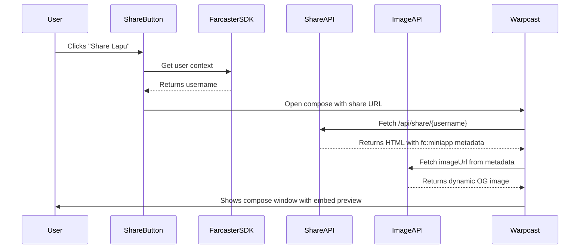

# Dynamic Embed Images for Lapu

This document explains how dynamic embed images work in the Lapu Farcaster miniapp.

## Overview

Dynamic embeds allow each user to share personalized content that displays their username in the embed image. This creates viral loops where every share is unique and engaging.

## Architecture

### 1. Image Generation API (`/api/og/[username].ts`)

This Vercel Edge Function generates dynamic Open Graph images using `@vercel/og`.

- **URL Pattern**: `https://lapu.gg/api/og/{username}`
- **Example**: `https://lapu.gg/api/og/alice`
- **Output**: 1200x630 PNG image with the username embedded

The image features:
- Lapu branding with gradient background (#76ADAB to #5A8A88)
- Personalized text: "{username} is building a floating city!"
- Call to action: "Join the adventure in the sky"

### 2. Share Page API (`/api/share/[username].ts`)

This Edge Function serves an HTML page with Farcaster miniapp metadata.

- **URL Pattern**: `https://lapu.gg/api/share/{username}`
- **Example**: `https://lapu.gg/api/share/alice`
- **Output**: HTML page with `fc:miniapp` metadata

The metadata includes:
```json
{
  "version": "1",
  "imageUrl": "https://lapu.gg/api/og/{username}",
  "button": {
    "title": "Play Lapu",
    "action": {
      "name": "Launch Lapu",
      "type": "launch_frame",
      "url": "https://lapu.gg"
    }
  }
}
```

### 3. Share Button Component (`/packages/client/src/components/ui/ShareButton.tsx`)

React component that triggers the share flow:

1. Gets the user's context from Farcaster SDK
2. Extracts the username (displayName, username, or FID)
3. Opens Warpcast compose window with the share URL
4. The URL points to `/api/share/{username}` which contains the dynamic metadata

## How It Works



## Testing

### Local Testing

1. **Test Image Generation**:
   ```bash
   # Start the dev server
   pnpm dev

   # In another terminal, test the image endpoint
   curl http://localhost:3000/api/og/testuser > test.png
   open test.png
   ```

2. **Test Share Page Metadata**:
   ```bash
   # Fetch the share page and check for metadata
   curl http://localhost:3000/api/share/testuser | grep "fc:miniapp"
   ```

3. **Test Share Button**:
   - Open the app in a Farcaster client or with `?miniApp=true`
   - Click the "🏝️ Share Lapu" button
   - Verify the compose window opens with the correct share URL

### Production Testing

After deploying to Vercel:

1. **Verify Image Endpoint**:
   ```bash
   curl https://lapu.gg/api/og/yourname > embed.png
   open embed.png
   ```

2. **Check Metadata**:
   ```bash
   curl -I https://lapu.gg/api/share/yourname
   curl https://lapu.gg/api/share/yourname | grep "fc:miniapp"
   ```

3. **Test in Farcaster**:
   - Share from within the Lapu miniapp
   - Verify the embed displays correctly in the feed
   - Verify clicking the embed launches the miniapp

## File Structure

```
lapu.gg/
├── api/
│   ├── og/
│   │   └── [username].ts      # Dynamic image generation
│   └── share/
│       └── [username].ts       # Share page with metadata
├── packages/
│   └── client/
│       └── src/
│           ├── components/
│           │   └── ui/
│           │       └── ShareButton.tsx  # Share button component
│           └── App.tsx          # Main app (includes ShareButton)
└── vercel.json                  # Vercel configuration
```

## Configuration

### Vercel Configuration (`vercel.json`)

```json
{
  "functions": {
    "api/**/*.ts": {
      "runtime": "edge"
    }
  },
  "rewrites": [
    {
      "source": "/api/:path*",
      "destination": "/api/:path*"
    }
  ]
}
```

### Dependencies

- `@vercel/og`: For dynamic image generation
- `@farcaster/miniapp-sdk`: For Farcaster integration

## Customization

### Modify the Image Design

Edit `/api/og/[username].ts` to customize:
- Colors and gradients
- Layout and positioning
- Font sizes and styles
- Additional user data display

### Modify the Share Message

Edit `/packages/client/src/components/ui/ShareButton.tsx`:
```tsx
const result = await sdk.actions.openUrl(
  `https://warpcast.com/~/compose?text=${encodeURIComponent(
    `Your custom message here!`  // <-- Change this
  )}&embeds[]=${encodeURIComponent(shareUrl)}`
);
```

### Add More Dynamic Data

Extend the share URL to include additional parameters:
```tsx
const shareUrl = `${window.location.origin}/api/share/${username}?score=${score}&level=${level}`;
```

Then update `/api/share/[username].ts` to read these parameters and pass them to the image API.

## Troubleshooting

### Embeds Not Displaying

1. Check that the share URL is accessible publicly
2. Verify the `fc:miniapp` metadata is present in the HTML
3. Ensure the imageUrl points to a valid, accessible image
4. Check Vercel function logs for errors

### Image Generation Fails

1. Verify `@vercel/og` is installed
2. Check that the Edge Runtime is enabled
3. Ensure image dimensions are 1200x630
4. Check for syntax errors in JSX structure

### Share Button Not Working

1. Verify Farcaster SDK is initialized
2. Check that the app is running in a Farcaster context
3. Look for errors in the browser console
4. Ensure the compose URL is properly encoded

## Resources

- [Farcaster Miniapp Documentation](https://docs.base.org/mini-apps)
- [Vercel OG Image Generation](https://vercel.com/docs/functions/edge-functions/og-image-generation)
- [Farcaster Miniapp SDK](https://github.com/farcasterxyz/miniapp-sdk)
